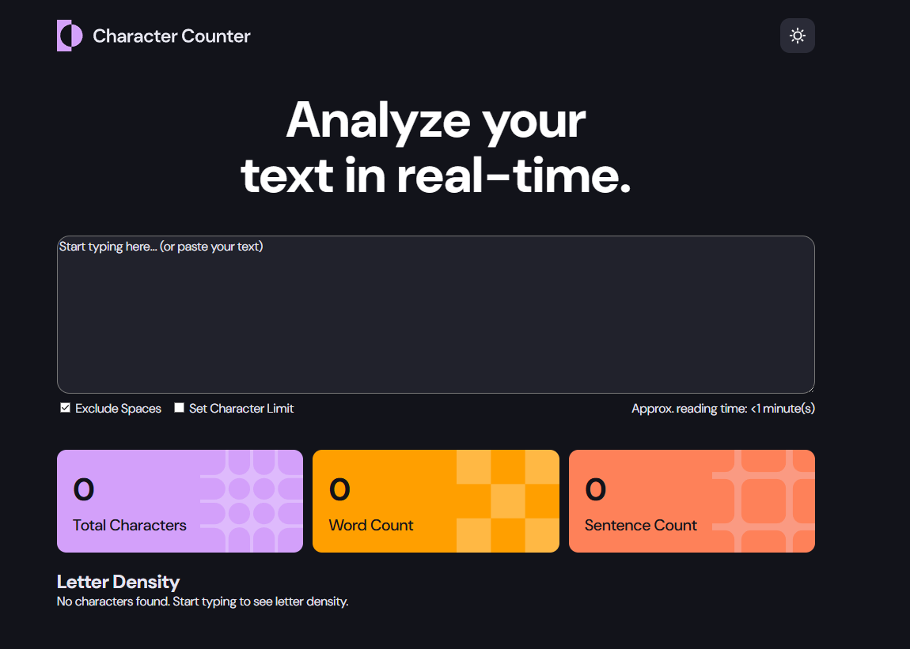
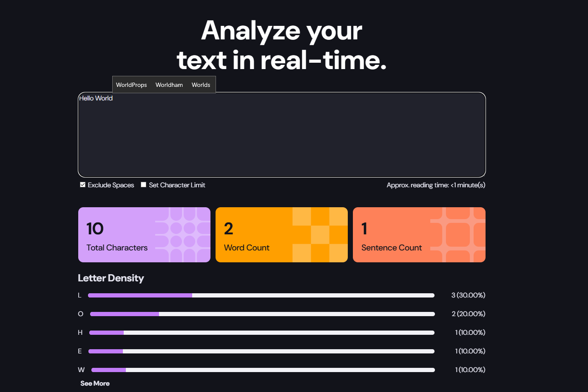

🔤 Character Counter App

A responsive Character Counter App built as part of a Frontend Mentor challenge.
The project focuses on real-time text analysis, user interaction, and dynamic UI updates using JavaScript.

🚀 Features

- Real-time character count
- Word and sentence counting
- Option to include/exclude spaces
- Character limit with warning system
- Responsive layout (mobile → desktop)
- Clean modern UI design

| Technology             | Purpose                       |
| ---------------------- | ----------------------------- |
| **HTML5**              | Semantic structure            |
| **CSS3**               | Styling and layout            |
| **JavaScript**         | Real-time logic & interaction |
| **Flexbox / CSS Grid** | Layout alignment              |
| **GitHub Pages**       | Deployment                    |

📸 Preview

In Action 

